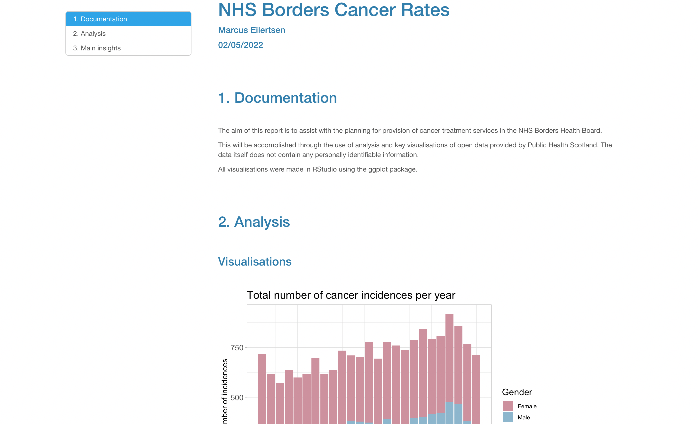
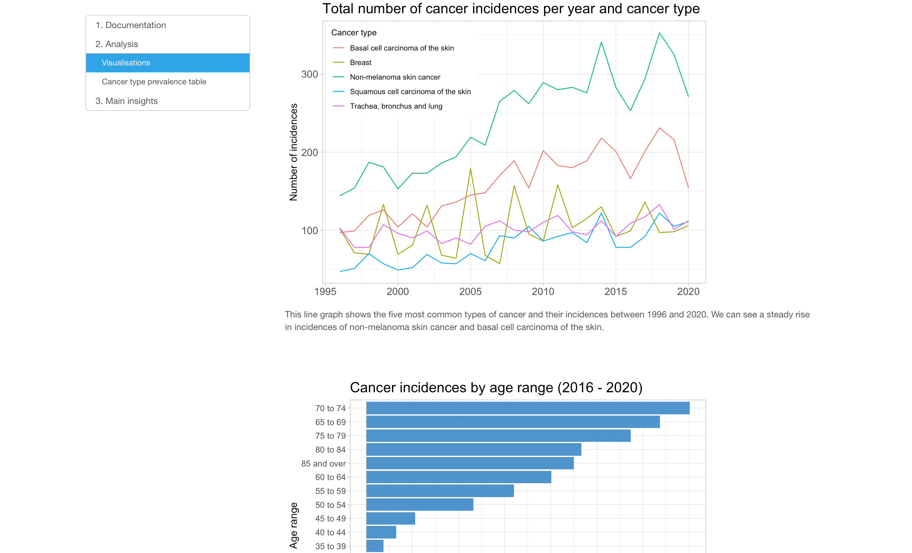
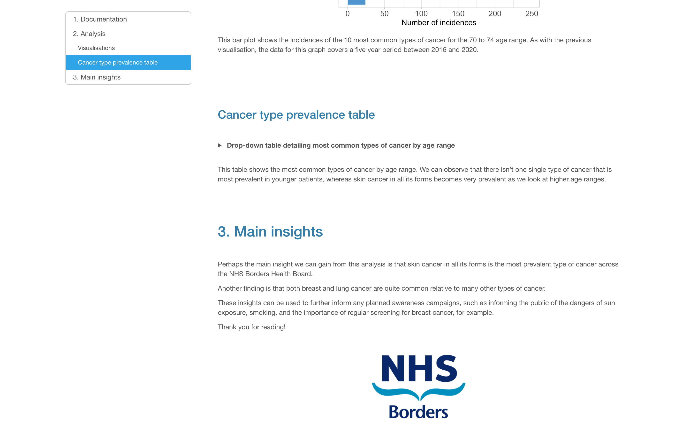

# NHS Borders Cancer Rates Analysis

## Overview

This repository contains an analysis of cancer incidence data from Public Health Scotland. The entire report was created in R. The objective is to help inform the planning for provision of cancer treatment services in NHS Borders. This project was undertaken as a part of CodeClan's Professional Data Analysis course.

[View Report](https://mrcslx.github.io/nhs_borders.html)

## Methodology

Through the use of data wrangling and key data visualisations, the aim of this report is to extract valuable insights from the data and present them in a clear and informative way.

## Packages Used

Data cleaning and wrangling was accomplished through the use of the `tidyverse` and `janitor` packages. All visualisations were made using the `ggplot` package.

## Screenshots

 

 

 

 

 

 

## References

All data was sourced from www.opendata.nhs.scot. Please see links below for datasets used:

- https://www.opendata.nhs.scot/dataset/geography-codes-and-labels/resource/652ff726-e676-4a20-abda-435b98dd7bdc
- https://www.opendata.nhs.scot/dataset/annual-cancer-incidence/resource/3aef16b7-8af6-4ce0-a90b-8a29d6870014
- https://www.opendata.nhs.scot/dataset/annual-cancer-incidence/resource/e8d33b2b-1fb2-4d59-ad21-20fa2f76d9d5
